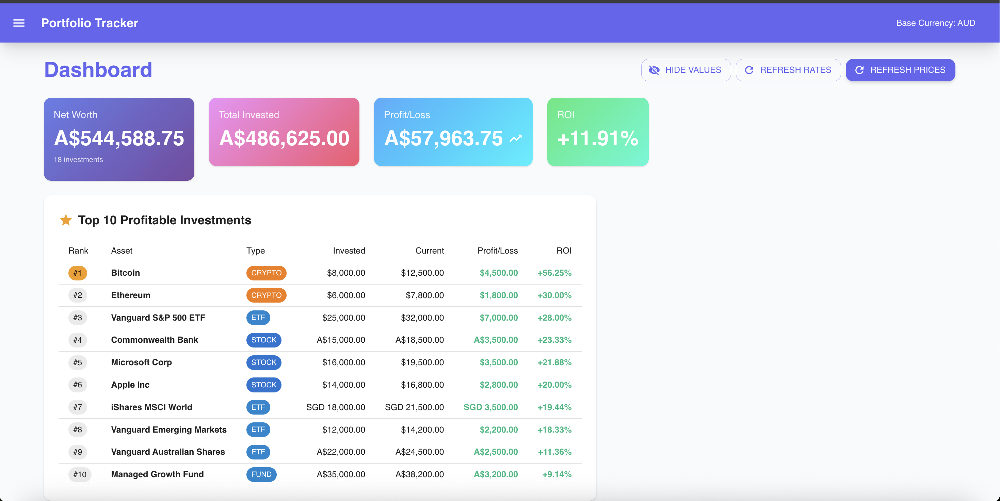
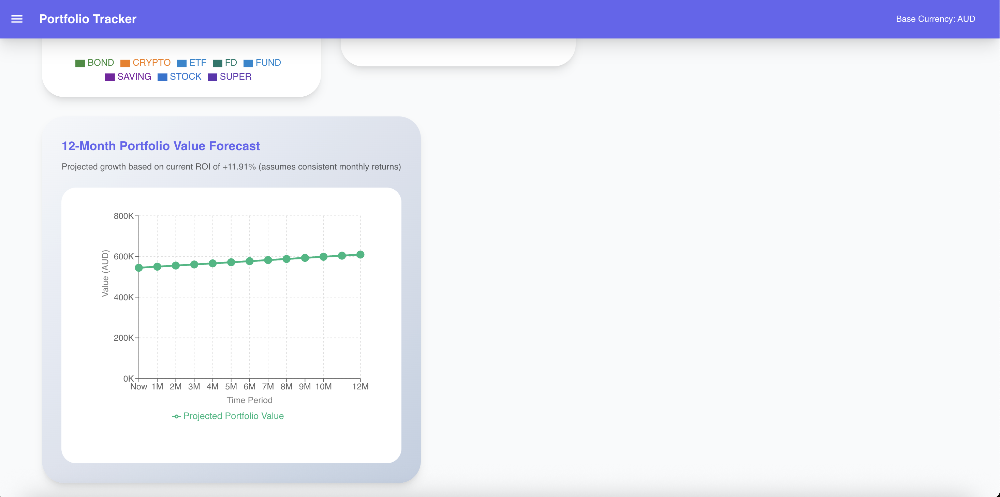
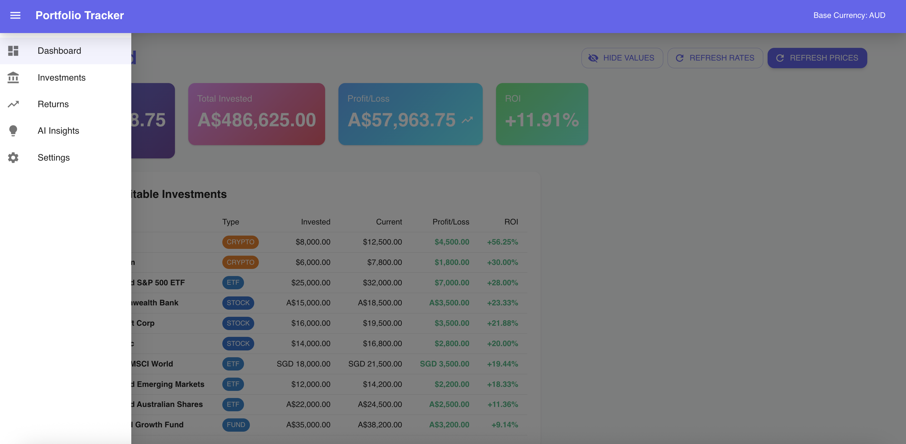
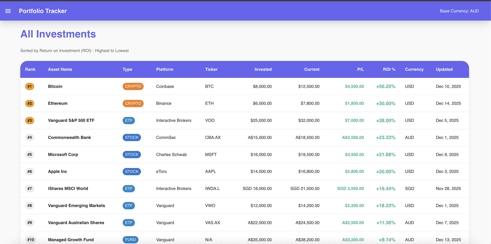
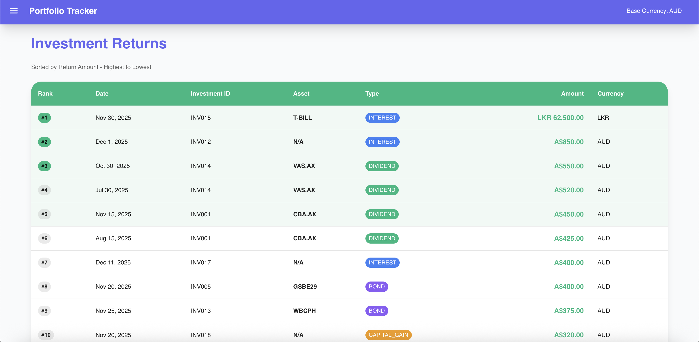
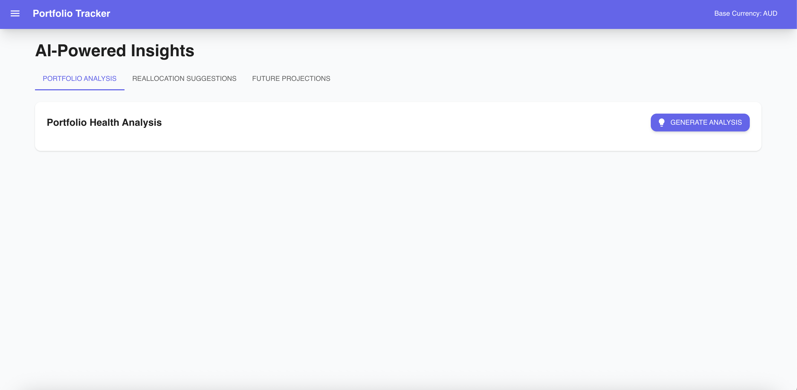
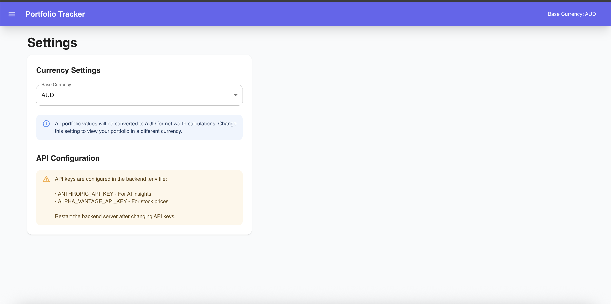

# Investment Portfolio Tracker

A full-stack web application to track your investment portfolio, calculate net worth across multiple currencies, and get AI-powered insights and recommendations.

## Features

- 📊 **Portfolio Dashboard**: View total net worth, investments breakdown, and performance metrics
- 💱 **Multi-Currency Support**: Track investments in AUD, SGD, USD, LKR with automatic conversion
- 📈 **Stock Price Integration**: Auto-fetch current prices for stocks via Alpha Vantage API
- 💰 **Historical Tracking**: Track returns over time (dividends, interest, bonds)
- 🤖 **AI-Powered Insights**: Get portfolio analysis, reallocation suggestions, and forecasts using Claude AI
- 📁 **Excel Import/Export**: Import your existing Excel portfolio data
- 🔄 **Auto-Update**: Automatically refresh exchange rates and stock prices

## Screenshots









## Tech Stack

**Backend:**
- Node.js + Express
- SQLite (better-sqlite3)
- Anthropic Claude API
- Alpha Vantage API
- Exchange Rate API

**Frontend:**
- React
- Material-UI / Chakra UI
- Recharts for data visualization
- Axios for API calls

## Project Structure

```
track-portfolio/
├── backend/
│   ├── src/
│   │   ├── db/              # Database schema and connection
│   │   ├── routes/          # API endpoints
│   │   ├── services/        # Business logic (currency, stocks, AI)
│   │   ├── utils/           # Excel parser and utilities
│   │   └── server.js        # Express server
│   ├── uploads/             # Uploaded Excel files
│   ├── .env                 # Environment variables
│   └── package.json
├── frontend/                # React application (to be set up)
├── excel/                   # Excel template and data files
└── README.md
```

## Getting Started

### Prerequisites

- Node.js (v18 or later)
- npm or yarn
- API Keys:
  - [Alpha Vantage API Key](https://www.alphavantage.co/support/#api-key) (free)
  - [Anthropic API Key](https://console.anthropic.com/) (for Claude AI)

### Backend Setup

1. Navigate to backend directory:
```bash
cd backend
```

2. Install dependencies:
```bash
npm install
```

3. Configure environment variables:
```bash
cp .env.example .env
```

Edit `.env` and add your API keys:
```
PORT=5000
NODE_ENV=development
DB_PATH=./portfolio.db

# Add your API keys
EXCHANGE_RATE_API_KEY=
ALPHA_VANTAGE_API_KEY=your_alpha_vantage_key_here
ANTHROPIC_API_KEY=your_anthropic_key_here

BASE_CURRENCY=AUD
```

4. Initialize the database:
```bash
npm run init-db
```

5. Start the server:
```bash
npm start
# or for development with auto-reload:
npm run dev
```

The API server will be running at `http://localhost:5000`

### Import Your Excel Data

1. Prepare your Excel file using the provided template in `excel/portpolio_app_improved.xlsx`

2. Use the import API endpoint:
```bash
curl -X POST http://localhost:5000/api/import/excel \
  -F "file=@excel/portpolio_app_improved.xlsx"
```

Or use the frontend UI once it's set up.

## API Endpoints

### Investments
- `GET /api/investments` - Get all investments
- `GET /api/investments/:id` - Get single investment
- `POST /api/investments` - Create new investment
- `PUT /api/investments/:id` - Update investment
- `DELETE /api/investments/:id` - Delete investment
- `GET /api/investments/summary/breakdown` - Get portfolio breakdown

### Portfolio
- `GET /api/portfolio/networth` - Get total net worth
- `GET /api/portfolio/returns` - Get all returns
- `GET /api/portfolio/returns/summary` - Get returns summary
- `POST /api/portfolio/refresh-rates` - Refresh exchange rates
- `POST /api/portfolio/refresh-prices` - Refresh stock prices
- `GET /api/portfolio/exchange-rates` - Get cached exchange rates

### AI Insights
- `POST /api/portfolio/ai-analysis` - Generate portfolio analysis
- `POST /api/portfolio/ai-reallocation` - Get reallocation suggestions
- `POST /api/portfolio/ai-projections` - Get future projections
- `GET /api/portfolio/ai-insights` - Get recent AI insights

### Import
- `POST /api/import/excel` - Import Excel file

### Settings
- `GET /api/settings` - Get all settings
- `PUT /api/settings/:key` - Update setting

## Excel File Format

The application expects an Excel file with two sheets:

### Networth Sheet
Columns: ID, Platform, Investment Type, Ticker Symbol, Asset Name, Invested Amount, Current Amount, Profit/Loss, Currency, Updated Date, Purchase Date, Quantity, Auto Update, Notes

### Investment Returns Sheet
Columns: Investment ID, Stock/Instrument, Return Type, Date, Amount, Currency, Notes

See `excel/portpolio_app_improved.xlsx` for the complete template.

## Usage Examples

### Get Net Worth
```bash
curl "http://localhost:5000/api/portfolio/networth?baseCurrency=AUD"
```

### Refresh Exchange Rates
```bash
curl -X POST http://localhost:5000/api/portfolio/refresh-rates \
  -H "Content-Type: application/json" \
  -d '{"baseCurrency": "AUD"}'
```

### Get AI Portfolio Analysis
```bash
curl -X POST http://localhost:5000/api/portfolio/ai-analysis \
  -H "Content-Type: application/json" \
  -d '{"baseCurrency": "AUD"}'
```

## Development Roadmap

- [x] Backend API with SQLite database
- [x] Excel import functionality
- [x] Currency conversion service
- [x] Stock price fetching
- [x] AI insights integration
- [ ] React frontend
- [ ] Dashboard UI
- [ ] Portfolio visualization charts
- [ ] Settings page
- [ ] AWS deployment

## Contributing

This is a personal project. Feel free to fork and customize for your own use.

## License

ISC

## Support

For issues and questions, please open an issue in the GitHub repository.
